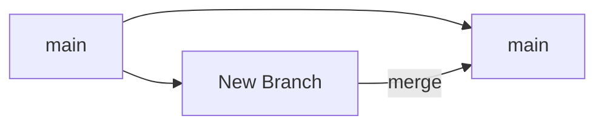
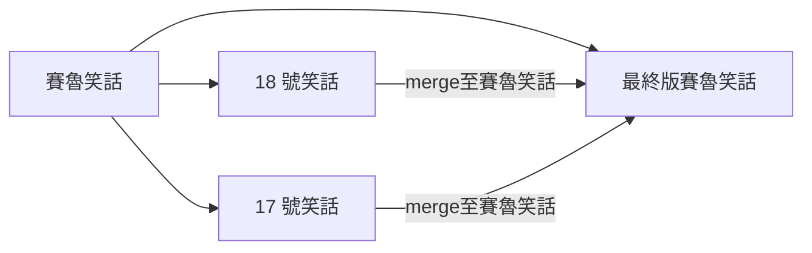

## 跟你朋友介紹 Git

>菜哥：「就是啊，我最近有一個煩惱。因為我的笑話太多了，所以我目前都用文字檔記錄在電腦裡，可是變得越來越多之後很難紀錄，而且我的笑話是會演進的。會有版本一、版本二甚至到版本十，這樣我就要建立好多個不同的檔案，弄得我頭很痛，聽說你們工程師都會用一種程式叫做 Git 來做版本控制，可以教我一下嗎？」

### 版本控制流程
下圖表將 git 的版本控制概念以圖表方式呈現，接下來會分別介紹各項目實際如何進行操作。
```flow
st=>start: 路徑切換至「菜哥笑話」資料夾
e=>end: 完成版本控制
op1=>operation: 設定 git
op2=>operation: 笑話檔案加入 git 追蹤
op3=>operation: 提交版本
op4=>operation: 檔案修改
op5=>operation: 切換版本
cond=>condition: 確認檔案是否加入 git 控制
cond2=>condition: 檔案是否不需修改
cond3=>condition: 是否切換版本

st->op1->op2->cond
cond(yes)->op3->cond2
cond(no)->op2
cond2(no)->op4->op2
cond2(yes)->cond3
cond3(yes)->op5->e
cond3(no)->e
```
#### 路徑切換至「菜哥笑話」資料夾
開啟 git bash，輸入 `cd 菜哥笑話` 將工作路徑切換至「菜哥笑話」資料夾。
#### 設定 git
在 git bash 輸入 `git init`。資料夾中會出現名稱為「.git」的隱藏資料夾，代表此資料夾可用 git 進行版本控制。
#### 笑話檔案加入 git 追蹤
「菜哥笑話」資料夾中有「笑話.txt」檔案，需輸入 `git add 笑話.txt` 才能讓檔案加入 git 追蹤。
#### 確認檔案室否加入 git 控制
可輸入 `git status` 查看當前 git 的狀態，包含版本以及追蹤與未追蹤的檔案。
#### 提交版本
輸入 `git commit -m "<版本1>"` ，就可提交版本。`git commit -m` 後面接上的雙引號中可輸入版本的說明。
若在 `git commit` 後加上 `-a` 則會檢測出有修改的檔案並提交，等於是把 `git add` 的動作加入。要注意的是新增的檔案無法透過 `git commit -a` 加入，需直接透過 `git add` 加入控制。
`git commit -am` 則是結合兩種用法，可以同時達到 `git commit` 加上 `-a` 與 `-m` 的效果。
#### 檔案修改
修改檔案後，需從新將檔案進行 `git add` 動作才能執行 `git commmit`。
#### 切換版本
若要檢視所有的版本，可輸入 `git log` 查看所有版本資訊。要切換到其中的版本，則須輸入 `git checkout <版本號碼>`。若要查看精簡版的版本號碼，可輸入 `git log --oneline`查看。
要回到最新版本則可輸入 `git checkout master`。


### 分支
>菜哥：「原來如此呀！那如果我有不同分支的笑話版本要管理怎麼辦？例如我想了一個七龍珠賽魯的笑話，然後剛好我也想到 17 號的笑話，還有 18 號的，這兩個版本的特色可以被賽魯版本吸收成最終版本。另外在最終版出來之前，我也不想要動到原本的話怎麼辦？教教我嘛><」
>
>既然菜哥有求於人，人很好的你當然不能拒絕。那首先來介紹一下 git 的 branch 概念是什麼？又是如何透過它來實現菜哥的笑話分支版本控制呢？

#### 分支的概念
Git 的 分支稱為 branch，使用者可以透過建立新的 branch 在不修改原本檔案的情況下，對檔案進行修改。修改完成的檔案可以透過 merge 將新分支合併回原分支。

所以在菜哥的情況中，可以下圖來解釋如何進行分支的管理。

因為菜哥在最終版本出來之前不想要修改到原本的笑話，因此需建立兩個新的 branch 「17 號笑話」與「18 號笑話」。兩個都完成之後，可以將兩個笑話分別 merge 至「賽魯笑話」。

接下來會說明 branch 實際如何操作。

#### 檢視 branch 狀態
`git branch -v`
輸入這行指令可以檢視目前 branch 的狀態，包含目前是在哪個 branch 上、有哪些 branch、目前各 branch 的版本狀態。
#### 建立新 branch
`git branch <在此輸入 branch 名稱>` （不需要加 `< >`）
輸入 `git branch` 後面接上自己定義的 branch 名稱即可完成創建新的 branch（。
#### 切換 branch
`git checkout <欲切換至的 branch >` （不需要加 `< >`）
輸入 `git checkout` 後面接上 branch 名稱即可切換至該 branch。
#### merge
`git merge <欲合併進來的 branch >`
先切換至要讓其他分支合併進的 branch，輸入 `git merge` 後面接上要合併進來的 branch 名稱即可將該 branch 合併。
#### 如果合併的檔案衝突怎麼辦
若遇到檔案衝突，在 merge 之後 git 會告訴你衝突有發生。這時可以輸入 `git status` 檢查是哪些檔案遇到衝突。將有衝突的檔案點開，檔案中能檢視哪些是地方有衝突，將有衝突的地方修改完成即可。

### GitHub
>菜哥：「啊啊還有啊，其實最近因為網友們說我爛梗太多了。所以我偷偷跟 H0w 哥結盟，要互相訂正彼此的爛梗。聽說有個叫 GitHub 的東西，可以實現多人協作欸！你知道怎麼用嗎？」
>
>菜哥的問題就像笑話一般不停冒出來，但身為濫好人的你也不能拒絕，只好硬著頭皮把你僅知的一點點 GitHub 小知識拿來分享。

GitHub 能讓你在雲端存放 git 版本控制，因為能檢視變動等特性使得它成為多人協作的利器。在這邊介紹如何將本地的檔案推送至 GitHub，以及將 GitHub 上的檔案版本拉至本地。

```sequence
Note left of 本地:branch
本地->GitHub: push
Note right of GitHub:merge
GitHub->本地: pull
GitHub-->本地: clone
```

#### 讓檔案在 GitHub 與本地同步
`git remote add origin <GitHub repository 網址>`
首先要先創建一個新的 GitHub repository，透過這行程式碼，就可以讓本地的檔案與遠端的開始進行同步。

#### 將檔案推送上 GitHub
`git push -u origin master`
remote 至 GitHub repository 之後，在 GitHub 上還不會看到程式碼。需透過這行程式碼將檔案推送至 GitHub 才會看到。

也可以推送不同的分支至 GitHub 只要將 `master` 改為要推送的 branch 名稱即可。
#### 將檔案從 GitHub 上拉下來
`git pull origin master`
輸入這行指令可以將 GitHub 上的版本拉至本地。例如其他人在 GitHub 上更新了 repository，如果想要讓該版本成為本地的檔案，可以直接輸入這行指令。

#### git clone
`git clone <GitHub repository 網址>`
輸入這行指令可以直接將 GitHub repository 複製一份至本地。