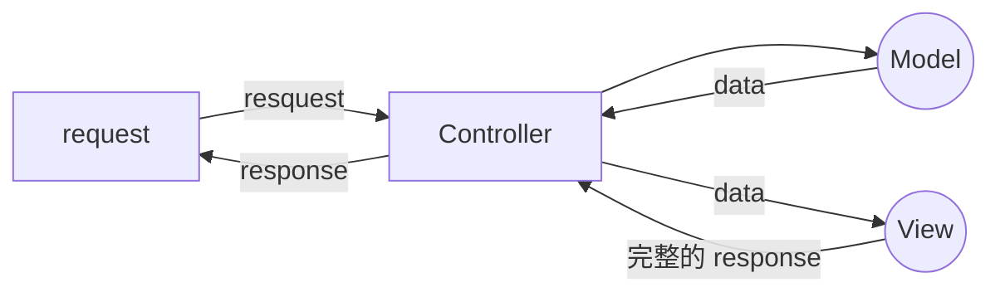

## 什麼是 MVC？

MVC（Model–view–controller）是一種軟體的設計模式（design pattern），將軟體系統分為三個基本部分：模型（Model）、視圖（View）和控制器（Controller）。

- Model
  負責資料，包含資料的存取、處理方法與邏輯模式
- View
  負責圖形介面的顯示
- Controller
  負責控制不同軟體的流程



MVC 架構的出現是為了解決早期網頁中處理資料的程式與負責顯示的 html 混雜在一起，造成後續維護不易的的狀況。

透過將 Model、View、Controller 分開，可以達成模組化的開發，例如多個 View 可以共用 Model，提升了程式碼的重用性。

## 請寫下這週部署的心得
### Nginx + pm2 
nginx + pm2 的部署過程折騰了 3~4 天，砍掉 EC2 instance 5、6 次以上才成功部署，成功當下的感想就是謝天謝地了吧。

因為沒有像用 LAMP 時有完整的手把手教學影片，因此花了很多時間在找資料上。儘管有前幾期學生的筆記，但筆記大多是挑重點講，不少部份需要自己找資料。

Nginx 的部份其實參考筆記很快就完成了，不過資料庫連接就成了頭痛的問題。有試過使用 LNMP 想一次套裝完成 nginx 與 mysql 的安裝，不過這個方法最後沒有嘗試成功。中間出現太多問題，於是直接改用其他方法。

參考了 [YouTube 上的影片](https://youtu.be/rE8mJ1OYjmM) 獨立安裝 nginx 並串接 AWS DRS mysql 資料庫才完成資料庫的連線。另外也遇到 port 被占用，`kill PID` 指令也無法刪除的狀況。以及 npm 安裝套件失敗等等問題，將 ` sudo apt install npm` 指令改用 `curl -fsSL https://deb.nodesource.com/setup_16.x | sudo -E bash -
sudo apt-get install -y nodejs` 也順利解決問題，當然 debug 過程都是非常非常漫長的...

最後以下是我採用的部署流程
#### 完整部署流程
1. EC2 新建 instance
2. 連線到 VPS
3. 安裝 nginx
   1. 防火牆設置
4. 到 /var/www/ git clone 專案
5. AWS RDS 新建 mysql 資料庫
6. 專案中補上連線資料庫用的帳號密碼
7. 安裝 node.js、npm
8. 安裝 npm packages
9. 安裝 sequelize-cli
10. 執行 sequelize 建立資料庫、資料表
    1. `sequelize db:create`
    2. `sequelize db:migrate`
11. 安裝 pm2
12. 執行 pm2 `sudo pm2 start index.js`
13. 到 /etc/nginx/sites-available 建立檔案 "example.com"
    1. 檔案內容如下，修改域名與 port
       ```
       server {
            listen       80;
            server_name  example.com;

            # 把 request 轉給 localhost 的 5566 port
            location / {
              proxy_pass http://127.0.0.1:5566;
            }
        }
        ```
        參考自：[俄羅斯不愧是戰鬥民族：nginx
](https://ithelp.ithome.com.tw/articles/10188498)
14. 到 etc/nginx/sites-enabled 執行 `sudo ln -s /etc/nginx/sites-available/example /etc/nginx/sites-enabled/`，會建立連結檔案
15. 重新載入 nginx `sudo systemctl reload nginx`
16. 部署成功！

## 寫 Node.js 的後端跟之前寫 PHP 差滿多的，有什麼心得嗎？
用 Express 寫後端最愉快的一點大概就是有許多方便的 middleware 可以運用，加上 sequelize 物件化的資料操作模式，讓 php + sql 可以統一轉化為 javascript 來寫，省去了腦袋要在不同程式語言跳來跳去的麻煩。

另一個好處是傳統的 php 網頁中的資料與顯示的程式碼都混雜在一起，用 Node.js 建構的 mvc 架構則讓程式的重用性大大提高，不但省去多餘的程式碼，若有變動時也方便管理。

不過若程式的規模並不大，採用 mvc 的 node.js 後端所需要的檔案數量會比 php 還多。以作業中的部落格來說，php 的版本只有 16 個，Express 的檔案數量則有 27 個。對於寫簡單的後端來說，php 也是有優點在。
