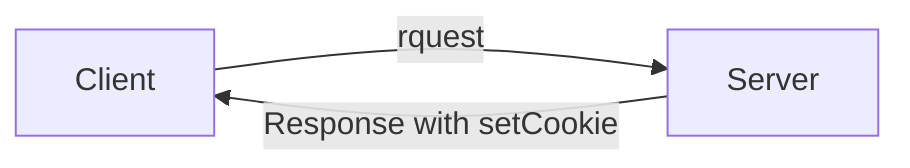
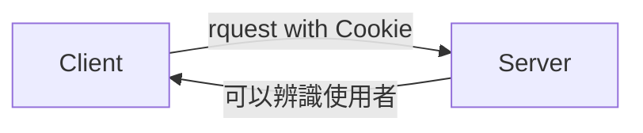

## 資料庫欄位型態 VARCHAR 跟 TEXT 的差別是什麼

### VARCHAR
通常字數較少會存成 VARCHAR，例如文章標題。

為可變長度（0 ~ 65,535）的字串，可自行設定最大的有效長度限制。

### TEXT
字數較長會存成 TEXT，例如文章內文。

純文字欄位，最大長度為同樣為 65,535，儲存時會附加 2 個位元組來記錄長度。

## Cookie 是什麼？在 HTTP 這一層要怎麼設定 Cookie，瀏覽器又是怎麼把 Cookie 帶去 Server 的？

由於 HTTP 是無狀態的，因此每一個 Request 不相關，Server 會無法辨識是否為同個使用者。

而 Cookie 存在的目的就是為了讓 Server 能辨識使用者，透過 Cookie 這個**儲存在瀏覽器的小型文字檔案**，Server 便能辨識不同的 Request 是否來自同個使用者。

透過讓 Server 發送 Cookie 給瀏覽器，而瀏覽器將 Cookie 儲存起來，以便讓 Server 能辨識使用者。

在 Server 發送 設定 Cookie 的 response 給 Client 端之後，Client 發送到 Server 的 request 的 header 中會帶上 cookie。




在 php 實作中，可以用 `setcookie()` 來設定 cookie，可參考此範例：
`setcookie("cookie 名稱", cookie 參數, 失效時間)`
`time()` 會回傳現在時間
```php=
  <?php
  $expire = time() + 3600 * 24 * 30;  //沒設時間會很快失效
  setcookie("username", $username, $expire)
?>
```


## 我們本週實作的會員系統，你能夠想到什麼潛在的問題嗎？

1. SQL 隱碼攻擊
目前的系統中帳號跟密碼沒有限制不能輸入特殊符號，因此若是使用者在登入時在帳號密碼欄輸入 `/*...*/`，那麼系統的 SQL 就會把部分的程式碼轉為註解，若再加上其他條件例如 `OR` 並加上搜尋全部的搜尋條件，就可能會導致驗證帳號的部分出現可以使用其他帳號狀況。
在沒有限制特殊符號的情況下，透過 SQL 隱碼攻擊甚至可以刪除整個資料庫或是讀取整個資料庫。

2. 資料庫中的密碼未加密
資料庫中的密碼沒有加密，要是有人得到資料庫的帳號密碼就可以得到所有使用者的密碼。

3. 無法以會員身分管理會員的留言內容
目前的會員系統是以 php 內建的 Session 來記住登入狀態，但是留言板的資料表中沒有關於會員 username 的欄位，因此若要可以以會員身分更改自己的留言，那麼還需要增加資料表欄位與相關控制的程式。
